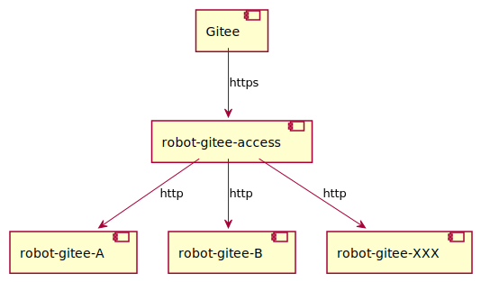

This is the access layer to recieve the webhook events of Gitee and dispatch them to the corresponding robots.



# How to run
- Install Bazel

It uses Bazel to compile and build/push image, so it should install it first.
You can reference [**here**](https://docs.bazel.build/versions/main/install.html) to install it.
Besides it had preset the version of bazel in file of `.bazelversion`, so it should install the one with matched version.

- Compile

Run `./build.sh build` to compile.

```shell

# ./build.sh build

*************** update repo ***************

Starting local Bazel server and connecting to it...
INFO: Analyzed target //:gazelle (66 packages loaded, 6952 targets configured).
INFO: Found 1 target...
Target //:gazelle up-to-date:
  bazel-bin/gazelle-runner.bash
  bazel-bin/gazelle
INFO: Elapsed time: 10.007s, Critical Path: 0.86s
INFO: 0 processes.
INFO: Build completed successfully, 1 total action
INFO: Build completed successfully, 1 total action
INFO: Analyzed target //:gazelle (4 packages loaded, 93 targets configured).
INFO: Found 1 target...
Target //:gazelle up-to-date:
  bazel-bin/gazelle-runner.bash
  bazel-bin/gazelle
INFO: Elapsed time: 2.013s, Critical Path: 0.05s
INFO: 0 processes.
INFO: Build completed successfully, 1 total action
INFO: Build completed successfully, 1 total action

*************** build binary ***************

INFO: Build option --platforms has changed, discarding analysis cache.
INFO: Analyzed target //:robot-gitee-access (18 packages loaded, 7135 targets configured).
INFO: Found 1 target...
Target //:robot-gitee-access up-to-date:
  bazel-bin/robot-gitee-access_/robot-gitee-access
INFO: Elapsed time: 22.995s, Critical Path: 18.72s
INFO: 2 processes: 2 linux-sandbox.
INFO: Build completed successfully, 3 total actions

```

The target binary is at `bazel-bin/robot-gitee-access_/robot-gitee-access`.

- Create config.yaml

Create a config file in format of yaml. See the [**config.go**](https://github.com/opensourceways/robot-gitee-access/blob/master/config.go) to get details for each configuration items.

```shell

# cat config.yaml

access:
  repo_plugins:
    zengchen1024/repo-test:
    - robot

  plugins:
  - name: robot
    endpoint: http://localhost:8888/gitee-hook
    events:
    - "Merge Request Hook"
    - "Note Hook"

```

- Create HMAC file

```shell

# openssl rand -hex 20 > ./hmac_secret

```

- Run

```shell

# ./robot-gitee-access --port=8000 --plugin-config=./config.yaml --hmac-secret-file=./hmac_secret

```

The command above will start the access in a web service which is listening on port of `8000` and ready to receive the webhook event of Gitee.

- Register a webhook on Gitee

Reference [**here**](https://gitee.com/help/articles/4184) to register the endpoint of `robot-gitee-access` to the Gitee webhook. Please choose the "WebHook Sign" and fill it with the hmac value generated above.
